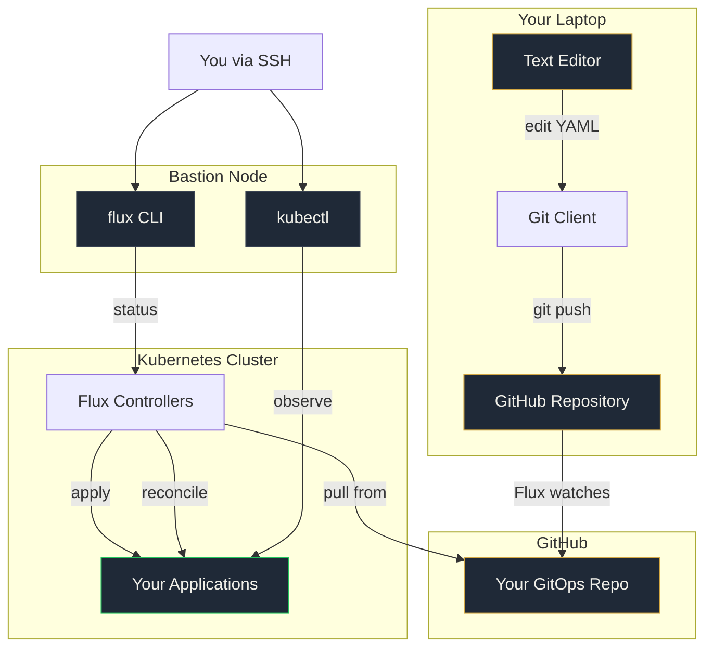

# Your Environment

Everything is pre-configured. No local installs. You'll be deploying within 45 minutes.

---

## How It All Fits Together



**Your laptop** is where you write code and push to Git. **The bastion node** is where you observe what Flux did. **You never deploy from either.** Git is the only way changes reach the cluster.

---

## What You Get

| Component | Purpose |
|-----------|---------|
| **Bastion node** | SSH access. kubectl, Flux, Helm, SOPS, age pre-installed. For observing the cluster. |
| **Kubernetes cluster** | Worker nodes ready. Flux will be installed in Lab 0. |
| **GitHub repository** | Your personal GitOps repo via GitHub Classroom. Where all changes live. |
| **Instruction page** | Your bastion IP, SSH key downloads (Mac + Windows), and cluster details. |

---

## Step 1: Open Your Instruction Page

Find the card on your desk with your participant number.

Open your browser and go to:

```
https://workshop.platformfix.com/gitops/join/participant-XXX/
```

Replace `XXX` with your number. For example, participant 7:

```
https://workshop.platformfix.com/gitops/join/participant-007/
```

!!! tip "Keep this tab open"
    You'll reference your instruction page throughout the day.

---

## Step 2: Connect to Your Bastion Node

Your instruction page has two download buttons:

- **Mac / Linux / WSL**: Download `id_rsa`, then:

    ```bash
    chmod 600 id_rsa
    ssh -i id_rsa root@<your-bastion-ip>
    ```

- **Windows (PuTTY)**: Download the `.ppk` file. Open PuTTY, load the PPK file in Connection > SSH > Auth, connect to your bastion IP.

The exact SSH command and bastion IP are on your instruction page.

---

## Step 3: Verify Your Cluster

Once connected to your bastion:

```bash
kubectl get nodes
```

You should see worker nodes in `Ready` state. If not, raise your hand.

---

## Step 4: Verify Your Tools

On the bastion, confirm everything is installed:

```bash
kubectl version --client
flux version --client
flux-operator --version
helm version --short
sops --version
age --version
```

All commands should return version numbers. If anything is missing, raise your hand.

---

## Step 5: Accept Your GitHub Repository

Click the GitHub Classroom link below (or Steve will share it on screen):

[Accept the Workshop Assignment](https://classroom.github.com/a/NvFcUrPS){ .md-button .md-button--primary target="_blank" }

1. Click the link and sign in with your GitHub account
2. A **private repository** will be created for you under the `platformfix` organisation
3. Clone it to your **local machine** (not the bastion):

    ```bash
    git clone https://github.com/platformfix/gitops-workshop-<your-github-username>.git
    cd gitops-workshop-<your-github-username>
    ```

4. Verify you can push:

    ```bash
    echo "test" >> notes.md
    git add notes.md
    git commit -m "Test push"
    git push
    ```

    Then revert the test:

    ```bash
    git revert HEAD --no-edit
    git push
    ```

!!! warning "Two machines, two roles"
    **Your laptop:** edit files, commit, push to GitHub. This is where you write YAML.

    **The bastion:** run kubectl and flux commands to observe what happened. This is where you watch Flux work.

    You never run `kubectl apply` to deploy. Git is the only path to the cluster.

---

## Step 6: Access the Flux Operator UI (set up in Lab 1)

The Flux Operator includes a built-in web dashboard. You'll access it via your bastion IP.

Lab 1 will walk you through setting it up. Once running:

```
http://<YOUR_BASTION_IP>:9080
```

!!! note "You'll set this up during Lab 1"
    Don't worry about this step now. Lab 1 walks you through it after your first deployment.

---

## Troubleshooting

| Problem | Fix |
|---------|-----|
| Can't download SSH key | Try a different browser. Check the URL matches your participant number. |
| SSH connection refused | Double check the IP from your instruction page. Make sure `chmod 600` was run on Mac/Linux. |
| PuTTY doesn't connect | Make sure you downloaded the `.ppk` file (not `id_rsa`). Load it in Connection > SSH > Auth. |
| kubectl not working | Run `cat ~/.kube/config` on the bastion. If empty, raise your hand. |
| GitHub Classroom link not working | Make sure you're signed into GitHub. Try an incognito window. |
| Can't push to GitHub | Check you cloned with the right URL. Run `git remote -v` to verify. |
| `git push` asks for password | Use HTTPS with a personal access token, or set up SSH keys for GitHub on your laptop. |

If none of that works, raise your hand. Don't waste lab time debugging access issues.
