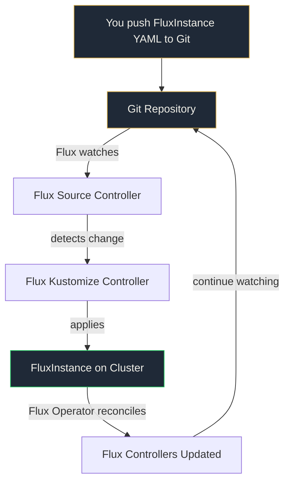

# Lab 0: Flux Operator Bootstrap

Install the Flux Operator and point it at your repository. By the end of this lab, Flux will be managing itself from your Git repo.

<span class="lab-duration">20 minutes</span>

---

## Objectives

By the end of this lab, you will:

- Install the Flux Operator on your Kubernetes cluster
- Create a FluxInstance that defines your Flux deployment
- Connect Flux to your personal GitHub repository
- Verify that Flux is running and syncing from Git
- Understand that Flux manages itself: change the config in Git, Flux updates itself

---

## Prerequisites

Before starting, make sure you have:

- [x] Connected to your bastion node via SSH (see [Environment](../access.md))
- [x] Verified `kubectl get nodes` shows Ready nodes
- [x] Accepted the [GitHub Classroom assignment](https://classroom.github.com/a/NvFcUrPS) and cloned your repo to your **local machine**

---

## How Flux Self-Management Works



Flux watches the repo that contains Flux's own configuration. Change the config in Git. Flux updates itself. GitOps all the way down.

---

## Task 1: Install the Flux Operator

On your **bastion node**, install the Flux Operator onto your cluster:

```bash
flux-operator install
```

Verify the operator is running:

```bash
kubectl get pods -n flux-system
```

You should see the `flux-operator` pod in a `Running` state.

!!! info "What just happened?"
    The Flux Operator is a Kubernetes operator that manages Flux itself. Instead of installing Flux components manually, you define a `FluxInstance` resource and the operator handles the rest. Change the resource, the operator updates Flux. Delete the resource, the operator removes Flux. GitOps for the GitOps tool.

---

## Task 2: Create a GitHub Personal Access Token

Flux needs to authenticate with your GitHub repository. Create a fine-grained personal access token:

1. Go to [github.com/settings/tokens?type=beta](https://github.com/settings/tokens?type=beta)
2. Click **Generate new token**
3. Name it: `flux-workshop`
4. Expiration: **7 days** (this is a workshop, not production)
5. Repository access: **Only select repositories** and choose your `platformfix/gitops-workshop-<your-username>` repo
6. Permissions: **Contents** (Read and write)
7. Click **Generate token**
8. Copy the token. You will need it in the next step.

!!! warning "Save your token"
    You won't be able to see the token again after leaving the page. Paste it somewhere safe (your `notes.md` is a good place).

---

## Task 3: Create the Git credentials secret

On your **bastion node**, create a Kubernetes secret with your GitHub credentials:

```bash
kubectl create secret generic flux-system \
  --namespace=flux-system \
  --from-literal=username=git \
  --from-literal=password=YOUR_GITHUB_TOKEN
```

Replace `YOUR_GITHUB_TOKEN` with the token you created in Task 2.

---

## Task 4: Create the FluxInstance

On your **local machine**, create the Flux configuration file.

Create the file `clusters/flux-instance.yaml` in your repository:

```yaml
apiVersion: fluxcd.controlplane.io/v1
kind: FluxInstance
metadata:
  name: flux
  namespace: flux-system
spec:
  distribution:
    version: "2.x"
    registry: "ghcr.io/fluxcd"
    artifact: "oci://ghcr.io/controlplaneio-fluxcd/flux-operator-manifests"
  components:
    - source-controller
    - kustomize-controller
    - helm-controller
    - notification-controller
  cluster:
    type: kubernetes
    multitenant: false
    networkPolicy: true
    domain: "cluster.local"
  sync:
    kind: GitRepository
    url: "https://github.com/platformfix/gitops-workshop-YOUR_USERNAME"
    ref: "refs/heads/main"
    path: "clusters"
    pullSecret: "flux-system"
```

!!! warning "Update the URL"
    Replace `YOUR_USERNAME` in the sync URL with your actual GitHub username. This is your personal repository created by GitHub Classroom.

Now commit and push:

```bash
git add clusters/flux-instance.yaml
git commit -m "Add FluxInstance configuration"
git push
```

---

## Task 5: Apply the FluxInstance

On your **bastion node**, apply the FluxInstance to your cluster:

```bash
kubectl apply -f https://raw.githubusercontent.com/platformfix/gitops-workshop-YOUR_USERNAME/main/clusters/flux-instance.yaml
```

!!! tip "One-time bootstrap"
    This is the only time you'll use `kubectl apply` directly. From now on, everything goes through Git. Flux will watch your repository and apply changes automatically, including changes to its own configuration.

---

## Task 6: Verify Flux is syncing

Wait 30 seconds, then check:

```bash
flux-operator status
```

Check the Flux components:

```bash
kubectl get pods -n flux-system
```

You should see the source-controller, kustomize-controller, helm-controller, and notification-controller all running.

Check that Flux is watching your repository:

```bash
flux get sources git -A
```

You should see your GitRepository with a `Ready` status.

---

## Task 7: Verify self-management

This is the key insight. Flux is now managing itself from your Git repo. The `FluxInstance` you pushed to `clusters/flux-instance.yaml` is the source of truth for how Flux is configured.

Check the Kustomization that manages the cluster:

```bash
flux get kustomizations -A
```

You should see a kustomization pointing to the `clusters` path of your repository.

!!! success "The aha moment"
    Flux is watching the `clusters/` directory of your repo. The `FluxInstance` resource you committed IS the Flux configuration. If you change it in Git, push, and wait: Flux updates itself. The tool that manages your deployments is itself managed by Git. This is GitOps all the way down.

---

## Validation

Confirm all of the following before moving on:

- [ ] Flux Operator pod is running in `flux-system` namespace
- [ ] All four Flux controllers are running (source, kustomize, helm, notification)
- [ ] GitRepository source shows `Ready` and points to your repo
- [ ] `clusters/flux-instance.yaml` exists in your repo on GitHub

---

## What you just built

```
your-repo/
└── clusters/
    └── flux-instance.yaml    <-- Flux manages itself from this file
```

Git is now the source of truth for your Flux deployment. Every change from this point forward goes through Git first, cluster second.

[Next: Lab 1 - Your First GitOps Pipeline](1-first-pipeline.md){ .md-button .md-button--primary }
