# Lab 2: Multi-Environment Mastery

Deploy the same application to dev, staging, and production with different configurations. One codebase. Three environments. Zero drift.

<span class="lab-duration">80 minutes</span>

---

## Objectives

By the end of this lab, you will:

- Restructure your repo using Kustomize base and overlays
- Deploy the same application to three environments with different settings
- Promote changes across environments through Git
- Understand why this eliminates "it works in staging" as a sentence

---

## Prerequisites

- [x] Completed [Lab 1: Your First GitOps Pipeline](1-first-pipeline.md)
- [x] podinfo is running in the `podinfo` namespace with 3 replicas

---

## Two Things Called "Kustomization" (Don't Panic)

This lab uses two different things that share the same name. This trips up everyone. Let's clear it up now.

```mermaid
graph TD
    subgraph "Kustomize (the tool)"
        A[kustomization.yaml] -->|"apiVersion: kustomize.config.k8s.io/v1beta1"| B[Combines and patches YAML files locally]
        B --> C[Output: plain Kubernetes manifests]
    end

    subgraph "Flux Kustomization (the CRD)"
        D[Kustomization resource] -->|"apiVersion: kustomize.toolkit.fluxcd.io/v1"| E[Tells Flux what to apply from Git]
        E --> F[Points to a path in your repo]
        F --> G[Flux applies whatever is at that path]
    end

    style A fill:#1F2937,stroke:#D4A843,color:#F0EFE8
    style D fill:#1F2937,stroke:#22C55E,color:#F0EFE8
```



| | Kustomize (the tool) | Flux Kustomization (the CRD) |
|--|---------------------|------------------------------|
| **API version** | `kustomize.config.k8s.io/v1beta1` | `kustomize.toolkit.fluxcd.io/v1` |
| **What it does** | Combines YAML files, applies patches and overlays | Tells Flux which directory in Git to watch and apply |
| **Where it lives** | `kustomization.yaml` inside your app directories | `clusters/` directory as a Flux resource |
| **Who runs it** | You (locally) or Flux (on the cluster) | Flux only |

In this lab you'll create **both**: Kustomize files that structure your app config, and Flux Kustomizations that tell Flux where to find them.

---

## The Problem

Right now you have one deployment of podinfo. In production, you need the same application running in dev (for testing), staging (for validation), and production (for real traffic). Each with different replica counts, resource limits, and possibly different image versions.

The wrong way: copy the YAML three times. Now you have three files to maintain, three sources of drift, and no guarantee they're consistent.

The right way: one base definition, three overlays that patch only what's different.

---

## Task 1: Restructure apps into base and overlays

On your **local machine**, restructure the `apps/podinfo/` directory.

First, create the new directory structure:

```bash
mkdir -p apps/podinfo/base
mkdir -p apps/podinfo/overlays/dev
mkdir -p apps/podinfo/overlays/staging
mkdir -p apps/podinfo/overlays/production
```

Move your existing files into the base:

```bash
mv apps/podinfo/namespace.yaml apps/podinfo/base/
mv apps/podinfo/deployment.yaml apps/podinfo/base/
mv apps/podinfo/service.yaml apps/podinfo/base/
mv apps/podinfo/kustomization.yaml apps/podinfo/base/
```

---

## Task 2: Update the base Kustomization

Edit `apps/podinfo/base/kustomization.yaml` to ensure it references the correct files:

```yaml
apiVersion: kustomize.config.k8s.io/v1beta1
kind: Kustomization
resources:
  - namespace.yaml
  - deployment.yaml
  - service.yaml
```

Also update `apps/podinfo/base/deployment.yaml`. Change the replicas back to 1 (the base is the minimum, overlays scale up):

```yaml
spec:
  replicas: 1
```

And remove the namespace from the base deployment and service. The overlays will set the namespace per environment. Update both `apps/podinfo/base/deployment.yaml` and `apps/podinfo/base/service.yaml`:

Remove or change the `namespace` field to be set by the overlay.

Actually, keep it simple. Remove `namespace.yaml` from the base entirely. Each overlay will create its own namespace. Update `apps/podinfo/base/kustomization.yaml`:

```yaml
apiVersion: kustomize.config.k8s.io/v1beta1
kind: Kustomization
resources:
  - deployment.yaml
  - service.yaml
```

And remove the `namespace:` field from both `deployment.yaml` and `service.yaml` in the base. The overlay will set it.

---

## Task 3: Create the dev overlay

Create `apps/podinfo/overlays/dev/namespace.yaml`:

```yaml
apiVersion: v1
kind: Namespace
metadata:
  name: dev
```

Create `apps/podinfo/overlays/dev/kustomization.yaml`:

```yaml
apiVersion: kustomize.config.k8s.io/v1beta1
kind: Kustomization
namespace: dev
resources:
  - namespace.yaml
  - ../../base
patches:
  - target:
      kind: Deployment
      name: podinfo
    patch: |
      - op: replace
        path: /spec/replicas
        value: 1
```

!!! info "What's happening here?"
    The overlay imports everything from `../../base` (the deployment and service) and applies it to the `dev` namespace. The patch sets replicas to 1. Dev doesn't need 3 replicas.

---

## Task 4: Create the staging overlay

Create `apps/podinfo/overlays/staging/namespace.yaml`:

```yaml
apiVersion: v1
kind: Namespace
metadata:
  name: staging
```

Create `apps/podinfo/overlays/staging/kustomization.yaml`:

```yaml
apiVersion: kustomize.config.k8s.io/v1beta1
kind: Kustomization
namespace: staging
resources:
  - namespace.yaml
  - ../../base
patches:
  - target:
      kind: Deployment
      name: podinfo
    patch: |
      - op: replace
        path: /spec/replicas
        value: 2
      - op: replace
        path: /spec/template/spec/containers/0/resources/requests/cpu
        value: 150m
      - op: replace
        path: /spec/template/spec/containers/0/resources/requests/memory
        value: 128Mi
```

---

## Task 5: Create the production overlay

Create `apps/podinfo/overlays/production/namespace.yaml`:

```yaml
apiVersion: v1
kind: Namespace
metadata:
  name: production
```

Create `apps/podinfo/overlays/production/kustomization.yaml`:

```yaml
apiVersion: kustomize.config.k8s.io/v1beta1
kind: Kustomization
namespace: production
resources:
  - namespace.yaml
  - ../../base
patches:
  - target:
      kind: Deployment
      name: podinfo
    patch: |
      - op: replace
        path: /spec/replicas
        value: 3
      - op: replace
        path: /spec/template/spec/containers/0/resources/requests/cpu
        value: 200m
      - op: replace
        path: /spec/template/spec/containers/0/resources/requests/memory
        value: 256Mi
      - op: replace
        path: /spec/template/spec/containers/0/resources/limits/cpu
        value: 500m
      - op: replace
        path: /spec/template/spec/containers/0/resources/limits/memory
        value: 512Mi
```

---

## Task 6: Update the Flux Kustomizations

Now tell Flux about each environment. On your **local machine**, replace `clusters/apps.yaml` with three separate Kustomizations.

Delete `clusters/apps.yaml` and create three new files.

Create `clusters/apps-dev.yaml`:

```yaml
apiVersion: kustomize.toolkit.fluxcd.io/v1
kind: Kustomization
metadata:
  name: apps-dev
  namespace: flux-system
spec:
  interval: 5m
  prune: true
  sourceRef:
    kind: GitRepository
    name: flux-system
  path: ./apps/podinfo/overlays/dev
  wait: true
  timeout: 2m
```

Create `clusters/apps-staging.yaml`:

```yaml
apiVersion: kustomize.toolkit.fluxcd.io/v1
kind: Kustomization
metadata:
  name: apps-staging
  namespace: flux-system
spec:
  interval: 5m
  prune: true
  sourceRef:
    kind: GitRepository
    name: flux-system
  path: ./apps/podinfo/overlays/staging
  wait: true
  timeout: 2m
```

Create `clusters/apps-production.yaml`:

```yaml
apiVersion: kustomize.toolkit.fluxcd.io/v1
kind: Kustomization
metadata:
  name: apps-production
  namespace: flux-system
spec:
  interval: 5m
  prune: true
  sourceRef:
    kind: GitRepository
    name: flux-system
  path: ./apps/podinfo/overlays/production
  wait: true
  timeout: 2m
```

---

## Task 7: Clean up the old namespace

Delete `apps/podinfo/base/namespace.yaml` if it's still there. The old `podinfo` namespace from Lab 1 will be pruned by Flux once we push, because the old `clusters/apps.yaml` that referenced it is gone.

---

## Task 8: Push and watch all three environments deploy

Your repo should now look like this:

```
your-repo/
├── clusters/
│   ├── flux-instance.yaml
│   ├── apps-dev.yaml            <-- NEW
│   ├── apps-staging.yaml        <-- NEW
│   └── apps-production.yaml     <-- NEW
├── apps/
│   └── podinfo/
│       ├── base/
│       │   ├── kustomization.yaml
│       │   ├── deployment.yaml
│       │   └── service.yaml
│       └── overlays/
│           ├── dev/
│           │   ├── kustomization.yaml
│           │   └── namespace.yaml
│           ├── staging/
│           │   ├── kustomization.yaml
│           │   └── namespace.yaml
│           └── production/
│               ├── kustomization.yaml
│               └── namespace.yaml
└── ...
```

Commit and push:

```bash
git add -A
git commit -m "Restructure podinfo for multi-environment with Kustomize overlays"
git push
```

On your **bastion node**, watch all three kustomizations reconcile:

```bash
flux get kustomizations --watch
```

Once all three show `Ready: True`, verify:

```bash
kubectl get pods -n dev
kubectl get pods -n staging
kubectl get pods -n production
```

You should see:

- **dev**: 1 replica
- **staging**: 2 replicas
- **production**: 3 replicas

Same application. Same base. Different configurations. Zero duplication.

!!! success "The aha moment"
    Three environments deployed from one base definition. Change the base and all three update. Change an overlay and only that environment changes. Promote a new image by updating one line in the base. This is how you eliminate "it works in staging."

---

## Task 9: Promote a change across environments

On your **local machine**, update the image version in the base. Edit `apps/podinfo/base/deployment.yaml`:

```yaml
image: ghcr.io/stefanprodan/podinfo:6.8.0    # changed from 6.7.0
```

Commit and push:

```bash
git add -A
git commit -m "Upgrade podinfo to 6.8.0 across all environments"
git push
```

On your **bastion node**, watch all three environments update:

```bash
kubectl get pods -n dev --watch &
kubectl get pods -n staging --watch &
kubectl get pods -n production --watch &
```

All three environments update to 6.8.0. One commit. Three deployments. No manual intervention.

Press `Ctrl+C` to stop the watches when done.

---

## Validation

Confirm all of the following before moving on:

- [ ] Three namespaces exist: `dev`, `staging`, `production`
- [ ] dev has 1 podinfo replica
- [ ] staging has 2 podinfo replicas
- [ ] production has 3 podinfo replicas
- [ ] All pods are running podinfo:6.8.0
- [ ] The old `podinfo` namespace from Lab 1 has been pruned
- [ ] `flux get kustomizations` shows `apps-dev`, `apps-staging`, `apps-production` all `Ready: True`

---

## What you built

```
your-repo/
├── clusters/
│   ├── flux-instance.yaml
│   ├── apps-dev.yaml
│   ├── apps-staging.yaml
│   └── apps-production.yaml
├── apps/
│   └── podinfo/
│       ├── base/                    <-- Shared definition
│       │   ├── kustomization.yaml
│       │   ├── deployment.yaml
│       │   └── service.yaml
│       └── overlays/                <-- Environment-specific patches
│           ├── dev/
│           ├── staging/
│           └── production/
└── ...
```

One base. Three overlays. Each overlay patches only what's different: replicas, resources, environment-specific settings. Everything else is inherited from the base. DRY configuration that scales from 3 environments to 30.

!!! quote "Think about your current setup"
    How many environments does your team manage? How different are the configs between them? How often does staging not match production? That's where Kustomize overlays change the game.

[Next: Lab 3 - Helm Integration](3-helm-integration.md){ .md-button .md-button--primary }
