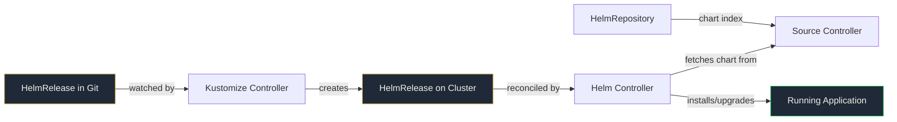

# Lab 3: Helm Integration

Replace raw YAML with a Helm chart managed by Flux. Same application. Proper packaging. Values, upgrades, and rollback built in.

<span class="lab-duration">40 minutes</span>

---

## Objectives

By the end of this lab, you will:

- Add a HelmRepository source to Flux
- Deploy an application using a HelmRelease
- Override Helm values through Git
- Upgrade a Helm release by changing one line in Git
- Understand why Helm + GitOps is better than either alone

---

## Prerequisites

- [x] Completed [Lab 2: Multi-Environment Mastery](2-multi-environment.md)
- [x] podinfo running in dev, staging, and production namespaces

---

## How Flux Manages Helm



Two controllers work together. The **Source Controller** fetches the chart from the HelmRepository. The **Helm Controller** installs and upgrades the release based on the HelmRelease spec. You change values in Git. Flux handles everything else. No `helm install` from anyone's laptop.

---

## The Journey So Far

In Lab 1, you wrote raw deployment and service YAML. In Lab 2, you structured it with Kustomize overlays. Both work. But in production, most teams use Helm charts: pre-packaged application definitions with configurable values.

The problem with Helm alone: someone runs `helm install` or `helm upgrade` from their laptop. The cluster changes. Git doesn't know about it. You're back to "what's actually running?"

The fix: Flux manages Helm. You define a `HelmRelease` in Git. Flux installs, upgrades, and rolls back the chart. Git stays the source of truth. Nobody runs `helm install` manually.

---

## Task 1: Clean up the raw YAML deployments

Labs 1 and 2 taught you raw YAML with Kustomize overlays. You've seen how that works. Now we're moving to Helm, which is how most production teams manage applications.

On your **local machine**, remove the Flux Kustomizations that watch the raw YAML directories:

```bash
rm clusters/apps.yaml clusters/apps-dev.yaml clusters/apps-staging.yaml clusters/apps-production.yaml
```

The `apps/podinfo/` directory stays in your repo as a reference. Flux just stops watching it because no Kustomization points to it anymore.

Commit and push:

```bash
git add -A
git commit -m "Remove raw YAML Flux Kustomizations (moving to Helm)"
git push
```

On your **bastion node**, force Flux to reconcile and watch the old resources get pruned:

```bash
flux reconcile kustomization flux-system
```

Wait 30 seconds, then verify:

```bash
kubectl get pods -n dev
kubectl get pods -n staging
kubectl get pods -n production
kubectl get pods -n podinfo
```

All should be empty or the namespaces gone. Git says "these don't exist anymore." Flux deletes them.

!!! info "The power of prune"
    Because we set `prune: true` on every Flux Kustomization, removing files from Git removes resources from the cluster. This is GitOps in action: the absence of a file is itself a declaration.

---

## Task 2: Add the HelmRepository

On your **local machine**, create the infrastructure directory for shared Helm sources.

Create `infrastructure/sources/kustomization.yaml`:

```yaml
apiVersion: kustomize.config.k8s.io/v1beta1
kind: Kustomization
resources:
  - podinfo.yaml
```

Create `infrastructure/sources/podinfo.yaml`:

```yaml
apiVersion: source.toolkit.fluxcd.io/v1
kind: HelmRepository
metadata:
  name: podinfo
  namespace: flux-system
spec:
  interval: 60m
  url: https://stefanprodan.github.io/podinfo
```

!!! info "What is a HelmRepository?"
    A HelmRepository tells Flux where to find Helm charts. It's like adding a repo with `helm repo add`, but declarative and managed by Git. Flux polls the repo index at the specified interval to discover new chart versions.

---

## Task 3: Tell Flux to manage infrastructure

Create `clusters/infrastructure.yaml`:

```yaml
apiVersion: kustomize.toolkit.fluxcd.io/v1
kind: Kustomization
metadata:
  name: infrastructure
  namespace: flux-system
spec:
  interval: 10m
  prune: true
  sourceRef:
    kind: GitRepository
    name: flux-system
  path: ./infrastructure/sources
  wait: true
  timeout: 2m
```

!!! info "Why a separate Kustomization?"
    Infrastructure (HelmRepositories, namespaces, shared resources) lives separately from applications. This way, the HelmRepository is available before any HelmRelease tries to use it. Order matters.

---

## Task 4: Create the production namespace and HelmRelease

The old production namespace was pruned. Create it fresh alongside the HelmRelease.

On your **local machine**, create `apps/podinfo-helm/namespace.yaml`:

```yaml
apiVersion: v1
kind: Namespace
metadata:
  name: production
```

Now create `apps/podinfo-helm/production.yaml`:

```yaml
apiVersion: helm.toolkit.fluxcd.io/v2
kind: HelmRelease
metadata:
  name: podinfo
  namespace: production
spec:
  interval: 5m
  chart:
    spec:
      chart: podinfo
      version: ">=6.0.0"
      sourceRef:
        kind: HelmRepository
        name: podinfo
        namespace: flux-system
  values:
    replicaCount: 3
    resources:
      requests:
        cpu: 200m
        memory: 256Mi
      limits:
        cpu: 500m
        memory: 512Mi
    ui:
      message: "Hello from production (Helm)"
```

Create `apps/podinfo-helm/kustomization.yaml`:

```yaml
apiVersion: kustomize.config.k8s.io/v1beta1
kind: Kustomization
resources:
  - namespace.yaml
  - production.yaml
```

---

## Task 5: Add a Flux Kustomization for the Helm-based app

Create `clusters/apps-podinfo-helm.yaml`:

```yaml
apiVersion: kustomize.toolkit.fluxcd.io/v1
kind: Kustomization
metadata:
  name: apps-podinfo-helm
  namespace: flux-system
spec:
  interval: 5m
  dependsOn:
    - name: infrastructure
  prune: true
  sourceRef:
    kind: GitRepository
    name: flux-system
  path: ./apps/podinfo-helm
  wait: true
  timeout: 5m
```

!!! info "dependsOn"
    The `dependsOn: infrastructure` ensures the HelmRepository exists before Flux tries to install the HelmRelease. Without this, Flux would fail because it can't find the chart source.

---

## Task 6: Push and watch Helm in action

Your repo should now look like this:

```
your-repo/
├── clusters/
│   ├── flux-instance.yaml
│   ├── infrastructure.yaml        <-- NEW: manages shared infra
│   └── apps-podinfo-helm.yaml     <-- NEW: Helm-based podinfo
├── apps/
│   └── podinfo-helm/              <-- NEW (Helm-managed)
│       ├── kustomization.yaml
│       ├── namespace.yaml
│       └── production.yaml
├── infrastructure/
│   └── sources/                   <-- NEW
│       ├── kustomization.yaml
│       └── podinfo.yaml
└── ...
```

Commit and push:

```bash
git add -A
git commit -m "Add Helm-managed podinfo alongside raw YAML version"
git push
```

On your **bastion node**, watch the infrastructure and Helm release deploy:

```bash
flux get kustomizations --watch
```

Once `infrastructure` and `apps-podinfo-helm` show `Ready: True`, check the Helm release:

```bash
flux get helmreleases -A
```

You should see the podinfo HelmRelease in the `production` namespace with status `Ready`.

Verify on the cluster:

```bash
kubectl get pods -n production
```

You should see the podinfo pods running in production, deployed by Helm via Flux. No raw YAML. No manual `helm install`. Git is the source of truth.

---

## Task 7: Explore the Helm release

On your **bastion node**, see how Flux manages Helm under the hood:

```bash
helm list -n production
```

You'll see the release that Flux created. You didn't run `helm install`. Flux did.

```bash
helm history podinfo -n production
```

One revision. Flux tracks the release lifecycle automatically.

---

## Task 8: Upgrade through Git

On your **local machine**, edit `apps/podinfo-helm/production.yaml` and change the UI message:

```yaml
  values:
    ui:
      message: "Hello from production (Helm) - upgraded via GitOps"
```

Commit and push:

```bash
git add -A
git commit -m "Update podinfo Helm values: new UI message"
git push
```

On your **bastion node**, watch the upgrade:

```bash
flux get helmreleases -A --watch
```

Once reconciled, check the Helm history:

```bash
helm history podinfo -n production
```

Two revisions now. The upgrade happened through Git. No `helm upgrade` command. No human in the loop.

---

## Task 9: Verify the clean transition (optional)

Now that Helm manages podinfo in production, you can remove the raw YAML Kustomize overlay for production. The Helm version is the upgrade path.

!!! tip "Keep both for now"
    In a real migration, you'd run both side by side, validate the Helm version, then remove the raw YAML. For the workshop, keeping both shows the progression from raw YAML to Helm.

---

## Validation

Confirm all of the following before moving on:

- [ ] HelmRepository `podinfo` exists in `flux-system` namespace
- [ ] HelmRelease `podinfo` exists in `production` namespace with status `Ready`
- [ ] `helm list -n production` shows the Flux-managed release
- [ ] `helm history podinfo -n production` shows 2 revisions
- [ ] `flux get kustomizations` shows `infrastructure` as `Ready: True`

---

## What you built

```
your-repo/
├── clusters/
│   ├── flux-instance.yaml
│   ├── infrastructure.yaml
│   ├── apps-dev.yaml
│   ├── apps-staging.yaml
│   ├── apps-production.yaml
│   └── apps-podinfo-helm.yaml
├── apps/
│   ├── podinfo/              <-- Raw YAML (Labs 1 & 2)
│   └── podinfo-helm/         <-- Helm-managed (Lab 3)
├── infrastructure/
│   └── sources/
│       └── podinfo.yaml      <-- HelmRepository
└── ...
```

You now have two deployment patterns in one repo: raw YAML with Kustomize overlays (the simple path) and HelmRelease with a shared HelmRepository (the production path). Both managed by Flux. Both sourced from Git.

!!! quote "Think about your current setup"
    How are Helm charts deployed on your team today? `helm install` from someone's laptop? A CI script that runs `helm upgrade`? What happens when two people upgrade at the same time? That's the problem HelmRelease solves.

[Next: Lab 4 - Secret Management with SOPS](4-sops-secrets.md){ .md-button .md-button--primary }
