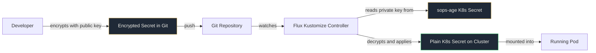

# Lab 4: Secret Management with SOPS

Your repository already contains an encrypted secret. In this lab, you'll give Flux the key to decrypt it, configure the decryption pipeline, and watch encrypted YAML in Git become a running secret in your cluster.

<span class="lab-duration">30 minutes</span>

---

## Objectives

By the end of this lab, you will:

- Create the Flux decryption secret from the workshop key
- Configure Flux to decrypt SOPS-encrypted secrets automatically
- Watch an encrypted secret in Git become a live Kubernetes Secret
- Mount the decrypted secret into a running application
- Understand how SOPS encryption works and why it's safer than every alternative

---

## Prerequisites

- [x] Completed [Lab 3: Helm Integration](3-helm-integration.md)
- [x] Flux is managing both raw YAML and Helm deployments

---

## What's Already in Your Repo

Take a look at these files that came with your template:

**`.sops.yaml`** in the root: tells SOPS which age public key to use for encryption.

**`sops/age-key.txt`**: contains the age key pair (public + private).

**`apps/podinfo-helm/secret.encrypted.yaml`**: a pre-encrypted Kubernetes Secret.

Open `apps/podinfo-helm/secret.encrypted.yaml` on GitHub or in your editor:

```bash
cat apps/podinfo-helm/secret.encrypted.yaml
```

!!! success "Notice what you can see"
    The metadata is in plain text: `name: podinfo-secrets`, `namespace: production`. You know what this secret is and where it goes. But the `stringData` values are encrypted. You can't read `API_KEY` or `DB_PASSWORD`. This is safe to commit to Git. This is SOPS.

!!! warning "Workshop only"
    In production, you would NEVER commit the private key (`sops/age-key.txt`) to Git. It would live securely on the cluster. For this workshop, it's included so you can focus on the workflow.

---

## How SOPS + Flux Works



The public key encrypts. The private key decrypts. Git only ever sees the encrypted version. The cluster only ever sees the decrypted version. Flux is the bridge.

---

## Task 1: Create the decryption secret for Flux

Flux needs the age private key to decrypt. On your **bastion node**:

```bash
cat << 'AGEKEY' | kubectl create secret generic sops-age \
  --namespace=flux-system \
  --from-file=age.agekey=/dev/stdin
# created: 2026-04-05T18:55:29+01:00
# public key: age1x4r5557tw69dwnjv87d0lz342auelwnxf9rcrlv7fmv9jskycv9qc6ynrj
AGE-SECRET-KEY-1FEUWA2066MH03X79XDQZTWL9UYZE8CV0532VJASEDP8FJDVVPNDSPAEWPG
AGEKEY
```

Verify:

```bash
kubectl get secret sops-age -n flux-system
```

!!! info "What just happened?"
    You created a Kubernetes Secret containing the age private key. Flux will use this to decrypt any SOPS-encrypted files it finds. One secret. Unlocks all your encrypted config.

---

## Task 2: Configure Flux to decrypt SOPS secrets

On your **local machine**, replace the entire contents of `clusters/apps-podinfo-helm.yaml` with the following. The only change from before is the `decryption` block at the bottom:

```yaml
apiVersion: kustomize.toolkit.fluxcd.io/v1
kind: Kustomization
metadata:
  name: apps-podinfo-helm
  namespace: flux-system
spec:
  interval: 5m
  dependsOn:
    - name: infrastructure
  prune: true
  sourceRef:
    kind: GitRepository
    name: flux-system
  path: ./apps/podinfo-helm
  wait: true
  timeout: 5m
  # NEW: tell Flux to decrypt SOPS-encrypted files in this path
  decryption:
    provider: sops
    secretRef:
      name: sops-age
```

!!! tip "What changed?"
    The only addition is the last 4 lines: the `decryption` block. This tells Flux: "when you find SOPS-encrypted files in this path, use the `sops-age` secret to decrypt them before applying."

Also replace the entire contents of `apps/podinfo-helm/kustomization.yaml` to include the encrypted secret:

```yaml
apiVersion: kustomize.config.k8s.io/v1beta1
kind: Kustomization
resources:
  - namespace.yaml
  - production.yaml
  - secret.encrypted.yaml
```

Commit and push:

```bash
git add -A
git commit -m "Enable SOPS decryption and include encrypted secret"
git push
```

---

## Task 3: Verify the secret was decrypted and applied

On your **bastion node**, wait for Flux to reconcile:

```bash
flux get kustomizations --watch
```

Once `apps-podinfo-helm` shows `Ready: True`:

```bash
kubectl get secret podinfo-secrets -n production
```

The secret exists. Verify the decrypted value:

```bash
kubectl get secret podinfo-secrets -n production -o jsonpath='{.data.API_KEY}' | base64 -d
```

You should see `my-super-secret-api-key-12345`.

!!! success "The aha moment"
    An encrypted file in Git became a decrypted Kubernetes Secret on the cluster. You didn't decrypt anything manually. Flux read the encrypted YAML, used the age key, and applied the plain secret. Automatically. On every reconciliation.

---

## Validation

- [ ] `sops-age` secret exists in `flux-system` namespace
- [ ] `secret.encrypted.yaml` is in your repo with encrypted values
- [ ] `kubectl get secret podinfo-secrets -n production` returns the secret
- [ ] Decrypted values can be verified: `kubectl get secret podinfo-secrets -n production -o jsonpath='{.data.API_KEY}' | base64 -d`

---

## What you built

```
your-repo/
├── .sops.yaml                        <-- Encryption rules
├── sops/
│   └── age-key.txt                   <-- Key pair (workshop only)
├── clusters/
│   └── apps-podinfo-helm.yaml        <-- UPDATED: decryption block
├── apps/
│   └── podinfo-helm/
│       ├── kustomization.yaml         <-- UPDATED: includes encrypted secret
│       ├── production.yaml            <-- UPDATED: extraEnvFrom
│       └── secret.encrypted.yaml      <-- Pre-encrypted, safe in Git
└── ...
```

!!! quote "Think about your current setup"
    Where do your secrets live right now? Be honest. How many people have access? How do you rotate them? SOPS gives you version history, access control via Git permissions, and encryption at rest.

[Next: Lab 5 - Monitoring and Troubleshooting](5-monitoring-troubleshooting.md){ .md-button .md-button--primary }
