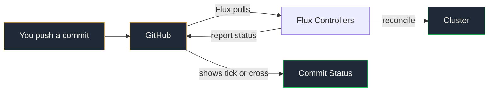

# Lab 5: Monitoring and Troubleshooting

Break things on purpose. Learn how to find out what's wrong, why it's wrong, and fix it through Git.

<span class="lab-duration">25 minutes</span>

---

## Objectives

By the end of this lab, you will:

- Set up Flux notifications so GitHub shows deployment status on your commits
- Monitor Flux health and reconciliation status
- Use the four-step troubleshooting pattern from 50+ platform rescues
- Diagnose and fix a broken deployment through Git
- Perform a rollback using `git revert` (not `kubectl rollout undo`)
- Suspend and resume Flux reconciliation for maintenance

---

## Prerequisites

- [x] Completed [Lab 4: Secret Management with SOPS](4-sops-secrets.md)
- [x] podinfo running in multiple namespaces via raw YAML, overlays, and Helm

---

## Task 1: Check the health of everything

On your **bastion node**, get a full picture of your Flux deployment:

```bash
flux get all
```

This shows every Flux resource: GitRepositories, Kustomizations, HelmRepositories, HelmReleases. Everything should be `Ready: True`.

For a quick health check of the Flux controllers themselves:

```bash
flux check
```

All components should report as healthy.

---

## Task 2: Set up GitHub commit status notifications

Flux can notify external systems when reconciliations succeed or fail. The most visual option: GitHub commit status. Every commit in your repo gets a green tick or red cross based on whether Flux successfully applied it.

First, create a secret with your GitHub token for the notification provider. On your **bastion node**, use the token you saved in `notes.md` during Lab 0:

```bash
kubectl create secret generic github-token \
  --namespace=flux-system \
  --from-literal=token=YOUR_GITHUB_TOKEN
```

Replace `YOUR_GITHUB_TOKEN` with the classic PAT you created in Lab 0 (check your `notes.md` if you forgot it). You'll also need your GitHub username for the next step.

Now on your **local machine**, create `clusters/notifications.yaml`, replacing `YOUR_USERNAME` with your GitHub username:

```yaml
apiVersion: notification.toolkit.fluxcd.io/v1beta3
kind: Provider
metadata:
  name: github-status
  namespace: flux-system
spec:
  type: github
  address: https://github.com/platformfix/gitops-workshop-YOUR_USERNAME
  secretRef:
    name: github-token
---
apiVersion: notification.toolkit.fluxcd.io/v1beta3
kind: Alert
metadata:
  name: github-status
  namespace: flux-system
spec:
  providerRef:
    name: github-status
  eventSeverity: info
  eventSources:
    - kind: Kustomization
      name: '*'
    - kind: HelmRelease
      name: '*'
```

!!! warning "Two things to replace before committing"
    1. Replace `YOUR_GITHUB_TOKEN` in the kubectl command with your actual token
    2. Replace `YOUR_USERNAME` in the Provider address with your GitHub username

Commit and push:

```bash
git add -A
git commit -m "Add GitHub commit status notifications"
git push
```

On your **bastion node**, verify the provider and alert are ready:

```bash
flux get alert-providers
flux get alerts
```

Now go to your repository on GitHub and look at your latest commit. You should see a green tick (or a pending/running status) next to it.

!!! success "The notification controller in action"
    From now on, every commit gets a status from Flux. Green means Flux applied it successfully. Red means something failed. Your team can see deployment status without leaving GitHub. No Slack bots. No dashboards. Just Git.



---

## Task 3: Learn the four-step troubleshooting pattern

When something goes wrong in a Flux-managed cluster, follow this pattern every time:

```bash
# Step 1: What failed?
flux get all

# Step 2: What's the error?
kubectl describe kustomization <name> -n flux-system

# Step 3: What happened?
flux events --for kustomization/<name>

# Step 4: Why?
kubectl logs -n flux-system deploy/kustomize-controller --tail=20
```

!!! info "This pattern works for everything"
    Replace `kustomization` with `helmrelease`, `gitrepository`, or any Flux resource. The four steps are the same: status, describe, events, logs.

---

## Task 4: Break something on purpose (and watch GitHub turn red)

Now that notifications are set up, you'll see the commit status change in real time. On your **local machine**, introduce a deliberate error. Edit `apps/podinfo/overlays/dev/kustomization.yaml` and add an invalid patch:

```yaml
apiVersion: kustomize.config.k8s.io/v1beta1
kind: Kustomization
namespace: dev
resources:
  - namespace.yaml
  - ../../base
patches:
  - target:
      kind: Deployment
      name: podinfo
    patch: |
      - op: replace
        path: /spec/replicas
        value: 1
  - target:
      kind: Deployment
      name: this-does-not-exist
    patch: |
      - op: replace
        path: /spec/replicas
        value: 99
```

Commit and push:

```bash
git add -A
git commit -m "Break dev overlay with invalid patch target"
git push
```

---

## Task 5: Diagnose the failure

On your **bastion node**, watch the kustomization fail:

```bash
flux get kustomizations --watch
```

You should see `apps-dev` go to `Ready: False`. Now use the four-step pattern:

**Step 1: What failed?**

```bash
flux get kustomizations
```

`apps-dev` shows `False`.

**Step 2: What's the error?**

```bash
kubectl describe kustomization apps-dev -n flux-system
```

Look at the `Status` section. It will tell you about the invalid patch target.

**Step 3: What happened?**

```bash
flux events --for kustomization/apps-dev
```

You'll see the reconciliation failure event with the specific error.

**Step 4: Why?**

```bash
kubectl logs -n flux-system deploy/kustomize-controller --tail=20
```

The controller logs show the full error. In production, this is where you'd find the root cause.

!!! success "The pattern works"
    Four commands. Every time. Status, describe, events, logs. This is how you debug a Flux-managed cluster. No guessing. No "have you tried restarting it?"

---

## Task 5: Fix it through Git

On your **local machine**, revert the broken commit:

```bash
git revert HEAD --no-edit
git push
```

On your **bastion node**, watch the fix apply:

```bash
flux get kustomizations --watch
```

`apps-dev` should go back to `Ready: True`. You fixed a broken deployment without touching kubectl. The fix is in the Git history. The rollback is auditable.

Check your repository on GitHub. The broken commit should have a red cross. The revert commit should have a green tick. Your team can see exactly which commits deployed successfully without leaving GitHub.

!!! warning "Never use kubectl rollout undo"
    In a GitOps workflow, `kubectl rollout undo` gets immediately overwritten by Flux. The reconciliation loop re-applies the state from Git. If you undo in the cluster but don't fix Git, the broken state comes back. Always fix through Git.

---

## Task 6: Suspend and resume

Sometimes you need to pause Flux. Maintenance windows. Debugging. Manual testing.

On your **bastion node**, suspend the dev kustomization:

```bash
flux suspend kustomization apps-dev
```

Verify it's suspended:

```bash
flux get kustomizations
```

`apps-dev` should show `Suspended: True`.

Now make a change on your **local machine**. Edit `apps/podinfo/overlays/dev/kustomization.yaml` and change replicas to 5:

```yaml
patches:
  - target:
      kind: Deployment
      name: podinfo
    patch: |
      - op: replace
        path: /spec/replicas
        value: 5
```

Commit and push:

```bash
git add -A
git commit -m "Scale dev to 5 replicas (Flux is suspended)"
git push
```

On your **bastion node**, check dev pods:

```bash
kubectl get pods -n dev
```

Still 1 replica. Flux is suspended. The change is in Git but not applied.

Now resume:

```bash
flux resume kustomization apps-dev
```

Wait a moment, then check:

```bash
kubectl get pods -n dev
```

5 replicas. The change in Git was applied the moment Flux resumed. Suspend pauses reconciliation. Resume catches up.

---

## Task 7: Force a reconciliation

Sometimes you don't want to wait for the interval. On your **bastion node**:

```bash
flux reconcile kustomization apps-dev
```

This triggers an immediate reconciliation, regardless of the interval timer. Useful after pushing a fix and wanting to see it applied now.

---

## Validation

Confirm all of the following before moving on:

- [ ] You can run the four-step troubleshooting pattern from memory
- [ ] You broke a deployment, diagnosed it with Flux commands, and fixed it via `git revert`
- [ ] You suspended and resumed a kustomization
- [ ] You forced a manual reconciliation
- [ ] `flux get all` shows everything as `Ready: True`

---

## What you learned

| Situation | Command |
|-----------|---------|
| What's the overall health? | `flux get all` |
| Is Flux itself healthy? | `flux check` |
| What failed? | `flux get kustomizations` |
| What's the error? | `kubectl describe kustomization <name> -n flux-system` |
| What happened? | `flux events --for kustomization/<name>` |
| Why? | `kubectl logs -n flux-system deploy/kustomize-controller` |
| Pause Flux | `flux suspend kustomization <name>` |
| Resume Flux | `flux resume kustomization <name>` |
| Apply now | `flux reconcile kustomization <name>` |
| Rollback | `git revert HEAD --no-edit && git push` |

These are the commands you'll use every day. Print this table. Stick it on your monitor. In a month it'll be muscle memory.

!!! quote "Think about your current setup"
    What was the last deployment incident your team had? How long did it take to diagnose? How many people were involved? How was it resolved? With the four-step pattern and Git-based rollback, most issues are diagnosed in 2 minutes and fixed in 1 commit.

[Next: Flux MCP Server Demo](flux-mcp-demo.md){ .md-button .md-button--primary }
